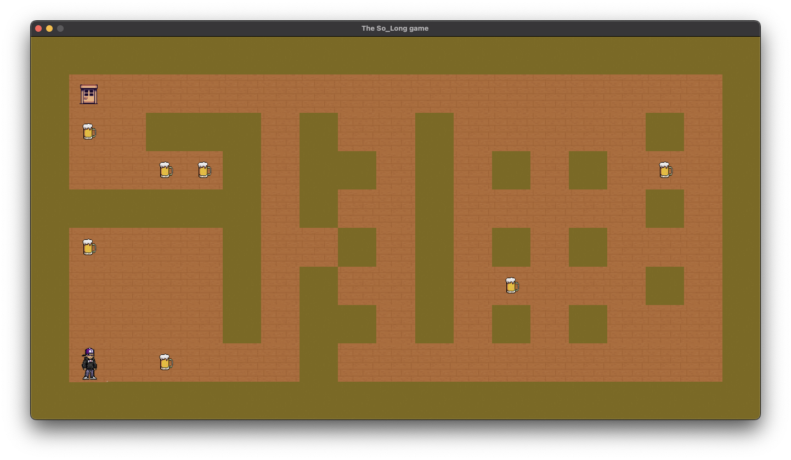

## 🕹️ 2D Game Project

### 🌐 Overview


This project is a 🎮 small 2D game developed in C, using the dynamic MiniLibX graphical library. The game leverages textures, sprites, and basic gameplay elements to create an engaging experience. The core objective of this project is to enhance my skills in areas such as window management, event handling, colouring, textures, and much more.

### 🌟 Features

🪟 Window management  
📝 Event handling  
🎨 Use of vibrant colors and appealing textures  
🕹️ Engaging gameplay elements  

### 🏗️ Code Structure

The code of this game revolves around several structures and functions:

- `t_game`: This structure keeps track of the game state, holding crucial information such as the game window, map, player position, number of collectibles, and steps taken.
- `t_sprites`: This structure manages the sprites used in the game, encompassing the hero, floor, collectible, border, and exit.
- `t_coordinates`: A simple yet useful structure that holds x and y coordinates.
- `t_mapdata`: This structure is responsible for storing the map data, including the map itself and its dimensions (width and height).

To provide a seamless gaming experience, the code also includes several functions for map validation, sprite loading, block drawing, and movement handling, among others.

## 🔧 Usage

### Steps for Compilation on macOS

Getting the game up and running on macOS involves a few simple steps:

1. Clone the GitHub repository:

    Open your terminal and execute the following command:

    ```
    git clone https://github.com/Awis13/so_long
    ```

2. Navigate into the project's directory:

    ```
    cd so_long
    ```

3. Compile the code:

    Run the `make` command in the terminal:

    ```
    make
    ```

    This command will compile all the code, create necessary objects, and generate an executable binary file.

4. Run the game:

    Use the following command, replacing `<map>` with your desired map argument:

    ```
    ./so_long <map>
    ```

    Enjoy your game! 😄

